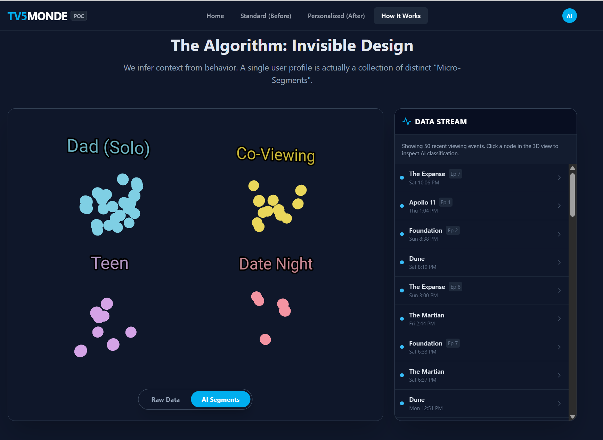
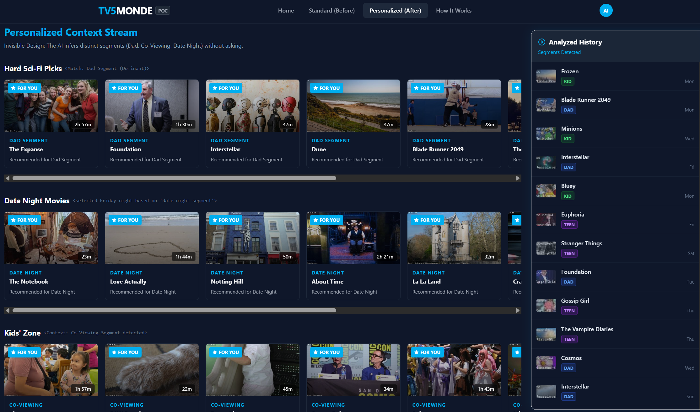

# TV5MONDE Personalization POC

> **“You don’t watch TV alone – why does your TV think you do?”**

**Live demo:**
[https://tv5monde-personalization-poc-1018361401762.us-west1.run.app](https://tv5monde-personalization-poc-1018361401762.us-west1.run.app)

---

## 1. What This POC Proves

Most recommendation engines assume:

> **One account = one person = one taste profile.**

Real life is messier:

* Parents watch late-night sci-fi alone.
* The same profile plays kids’ cartoons in the morning.
* Friday night is rom-coms with a partner.
* Teens and guests also use the same login.

Standard algorithms try to reconcile *all* of that as a single taste vector.
They either:

* Mix everything together (“Top Picks” = Dune + Peppa Pig + Euphoria), or
* Downplay “weird” behavior as noise.

This POC shows a simpler, more realistic alternative:

> Treat a single profile as **multiple viewing segments** (solo, family, kids, date night, teen, etc.).
> Use straightforward segmentation and scheduling – **no heavy ML required** – to make recommendations that match real viewing habits.

The goal is to show that this approach is:

* Easy to reason about
* Easy to prototype
* Easy to test against real data




---

## 2. Methodology Overview

### 2.1 Core Assumptions

1. **Shared usage is the norm.**
   Each account will be used:

   * Alone (primary viewer)
   * With kids
   * With partner / friends
   * Sometimes by teens or other household members

2. **Viewing behavior contains enough signal.**
   We treat the following as available data (synthetic for the POC, real in future):

   * Title watched
   * Genre / category (sci-fi, kids, rom-com, drama…)
   * Time and day of viewing
   * Device / room (Living Room TV vs Mobile – optional)
   * Completion signal (stopped early vs watched most of it)

3. **We don’t need deep learning to test the concept.**
   Basic classification and rules are enough to prototype:

   * Simple segment labels
   * Percentages by segment
   * Time-based scheduling rules




If the simple version already works well, then more advanced ML is just an optimization layer later.

---

### 2.2 From Raw History To Segments

We start from raw viewing history for a single profile (as shown on the **Standard (Before)** page):

Example “Dad” profile history:

* Interstellar, Cosmos, The Expanse, Blade Runner 2049
* Bluey, Peppa Pig, Frozen, Minions
* Stranger Things, Euphoria, The Vampire Diaries
* The Notebook, Love Actually, About Time

We then apply **simple rules** to assign each viewing event to a segment.

#### Step 1 – Rule-based classification

Rules (illustrative, not exhaustive):

* If **age rating ≤ kids** + genre “kids / animation” + **morning / weekend** → `Kids` segment
* If **sci-fi / science / documentary** + **late night** → `Dad (Solo)` segment
* If **teen / YA drama or horror** + **evening / after school** → `Teen` segment
* If **rom-com / romantic drama** + **Friday or Saturday evening** → `Date Night` segment

Each event gets a **segment tag**:

* “Interstellar” → `Dad`
* “Frozen” → `Kids`
* “Stranger Things” → `Teen`
* “The Notebook” → `Date Night`

No clustering algorithm is strictly required for the POC – just sensible rules that a human would agree with.

#### Step 2 – Segment percentages

Once every event is tagged, we compute:

[
\text{segment share} = \frac{\text{events in segment}}{\text{total events}}
]

In the demo dataset we get something like:

* `Dad` (Solo) ≈ 50%
* `Kids` ≈ 25%
* `Teen` ≈ 15%
* `Date Night` ≈ 10%

These percentages tell us:

* How much of this profile’s behavior belongs to each viewing mode
* How much screen real estate each mode deserves

---

### 2.3 Why This Fixes “Outliers”

In a typical recommender:

* “Frozen” on a sci-fi heavy account looks like an out-of-pattern event.
* The engine either:

  * Overreacts (“Maybe you like kids content now!”), or
  * Ignores it as noise.

In this method:

* “Frozen” is not an outlier – it is a **Kids segment event**.
* Kids events form their **own segment** with its own recommendations.
* Sci-fi stays cleanly in the `Dad` segment.

So instead of “How do we average Dad’s sci-fi with Frozen?”, we ask:

* “What should we show when this profile is behaving like Dad?”
* “What should we show when this profile is behaving like Kids?”
* “What should we show on Friday night when this profile behaves like Date Night?”

---

### 2.4 Generating Recommendations Per Segment

For each segment, we can rank titles using very simple logic:

1. Filter content by **segment-appropriate genres / age rating**.
2. Prioritize titles:

   * Similar to previously watched titles in that segment
   * High completion / rewatch rates in that segment
   * Popular in similar households (global or regional)

Pseudo-scoring:

```text
score = w1 * similarity_to_segment_titles
      + w2 * completion_rate_in_segment
      + w3 * popularity_in_segment
```

Each segment produces its own **ranked list**.

---

### 2.5 Time-aware Scheduling

The final step is **when** to show which segment.

We use simple time-of-week rules:

* Weekday late nights → favor `Dad` segment rows
* Weekend mornings → favor `Kids` rows
* Friday/Saturday evenings → boost `Date Night` rows to the top
* Early evenings with teen content → show `Teen Picks` row

In the “How It Works” page example, **“The Notebook”** is classified as `Date Night`, and the system recommends scheduling similar titles as priority rows on **Friday and Saturday evenings**.

This is not prediction magic – it’s treating **time** as a first-class input.

---

### 2.6 Comparison To Standard Recommenders

**Standard approach:**

* One blended profile vector
* “Because you watched X” rows using the entire mixed history
* No explicit notion of `Dad vs Kids vs Date Night`

**Our approach:**

* One account → multiple **micro-segments**
* Each micro-segment has:

  * Its own content pool
  * Its own ranking
  * Its own *time window* where it should dominate the UI
* No extra login, profiles, or user effort

The logic can run with:

* SQL + basic heuristics, or
* A simple script running nightly – no advanced ML required to test.

---

## 3. Frontend Demo – Page by Page

Live demo: [https://tv5monde-personalization-poc-1018361401762.us-west1.run.app](https://tv5monde-personalization-poc-1018361401762.us-west1.run.app)

The POC is intentionally **front-end only**. It uses synthetic data and hardcoded segments to demonstrate what an upgraded personalization engine *would look like*.

### 3.1 Home – Concept Overview

**What you see**

* TV5MONDE branding and navigation tabs
* An **intro video** (~8 seconds): one viewer on a couch, then kids, family, and a date appear around them, then fade, with the line:

  > “I don’t always watch TV alone… you should know this.”
* Short copy explaining the core idea:

  * Shared accounts
  * Multiple viewing contexts
  * Why treating everything as one profile is flawed

**Purpose**

* Quickly align non-technical viewers on the problem
* Set up the core tagline:

  > **“You don’t watch TV alone – why does your TV think you do?”**

---

### 3.2 Standard (Before) – Industry Status Quo

This page shows **how most algorithms behave today**.

**Layout**

* Main content area with standard streaming rows:

  * “Top Picks for You”
  * “Location Popular”
  * “Because you watched Bluey”
* A **“Recently Watched”** sidebar on the right showing raw viewing history (Frozen, Blade Runner 2049, Minions, Interstellar, Bluey, Stranger Things, Foundation, etc.)

**Key points**

* The “Top Picks” row is a **chaotic mix**:

  * Dune, The Expanse, Foundation, Encanto, Peppa Pig, etc.
  * All jammed into one “for you” list.
* The description at the top explains that the algorithm:

  * Treats all history equally
  * Has no way to know when content is for Dad, Kids, Teen, or Date Night

This screen is deliberately familiar: it looks “good enough” at first glance but exposes why users feel their recommendations are off.

---

### 3.3 Personalized (After) – Multi-Segment View

This page shows the same profile **after** applying segment logic.

**Layout**

* Rows are **relabeled and restructured**:

  1. **Hard Sci-Fi Picks**

     * Only sci-fi / space titles (Interstellar, The Expanse, Foundation, Dune…)
     * Cards tagged “Dad Segment – Recommended for Dad Segment”
     * Represents ~50% of viewing

  2. **Date Night Movies**

     * Titles like The Notebook, Love Actually, Notting Hill, La La Land
     * Explicitly selected for **Friday and Saturday nights**
     * Cards tagged “Date Night – Recommended for Date Night”

  3. **Kids’ Zone**

     * Bluey, Peppa Pig, Minions, other kids content
     * Cards tagged “Kids Segment – Recommended for Kids Segment”

* Right sidebar becomes **“Analyzed History”** instead of raw history:

  * Each title has a small colored label:

    * `KID`, `DAD`, `TEEN`, `DATE`
  * You can see that:

    * Frozen → `KID`
    * Blade Runner 2049 → `DAD`
    * Minions → `KID`
    * Stranger Things → `TEEN`
    * The Notebook → `DATE`

**What this demonstrates**

* Same underlying history, different interpretation.

* Instead of averaging everything into one messy feed, we show:

  * Clean sci-fi row for solo viewing
  * Clean kids row for co-viewing
  * Clean date-night row, promoted at the right time

* The UI changes **without asking the user to do anything**.

---

### 3.4 How It Works – Methodology & Visualization

This page explains the **algorithm in plain language** for executives and technical judges.

**Left side – Segment Clusters**

* A simple scatter-style visualization:

  * `Dad (Solo)` cluster
  * `Co-Viewing / Kids` cluster
  * `Teen` cluster
  * `Date Night` cluster

Each dot is a viewing event.
The cluster names show that **one account contains many micro-segments**.

**Right side – Event Analysis Panel**

Example for **“The Notebook”**:

* Tags:

  * Segment: `Date Night`
  * Context: Living Room TV
* Recommended scheduling:

  * “Fri 6–10pm, Sat 6–10pm” as optimal window for this segment
* Confidence bar:

  * e.g., 94% confidence that this belongs to Date Night / shared viewing
* “Recommended Next”:

  * Paddington 2, Wonka, etc., showing follow-up logic

**Bottom toggle**

* `Raw Data` vs `AI Segments`:

  * `Raw Data` → events look scattered and random
  * `AI Segments` → same events grouped into meaningful clusters

**Purpose**

* Show that the “magic” is not black-box AI.
* Explain, visually, that:

  * We infer context from behavior
  * Out-of-pattern titles create **new segments** instead of breaking the model
  * Time of week ties everything together for the final recommendations

---

## 4. Implementation Notes (POC Scope)

* **Frontend only**:

  * React + Vite + Tailwind
  * Synthetic data file for viewing history
  * Hardcoded segment assignments and percentages for clarity
* **No backend, no real user data**:

  * All logic runs in the browser
  * Easy to port to other stacks later
* **Expandable**:

  * V2 could plug into Supabase or another DB
  * Same rules can be expressed as SQL queries or a simple rules engine
  * Once proven, a proper recommender / ML layer can refine segment detection

The important part for this hackathon is the **methodology**:

* Treat each account as multiple segments.
* Classify events with common-sense rules.
* Rank and schedule per segment.
* Show the before vs after side by side.

---

## 5. Why This Is Worth Testing

* It solves the **shared account** problem that almost every service has.
* It doesn’t require new data – just better use of what’s already there.
* It can be tested with:

  * Synthetic data (as in this POC)
  * A few weeks of real logs
  * Simple A/B style comparisons (e.g. engagement on Friday nights with vs without date-night rows)

If this simple method yields clear improvement, then investing in a full ML implementation is an obvious next step.

> **You don’t watch TV alone – this is how your TV can finally act like it knows that.**


---

# tldr;

## The Problem

Standard broadcast recommendation systems fail in shared-account scenarios:

- **Chaotic Recommendations**: A "Top Picks" row mixing Dad's sci-fi with kids' cartoons and teen dramas
- **Profile Confusion**: Algorithms treat all viewing history as belonging to a single persona
- **Context Blindness**: No awareness of temporal patterns (e.g., Friday date nights vs. Saturday morning cartoons)

## The Solution Summary: Multi-Segment Personalization

Our AI engine analyzes viewing behavior to identify **Micro-Segments** within a single profile:

| Segment | Example Content | Behavioral Signals |
|---------|-----------------|-------------------|
| **Dad Solo** (50%) | The Expanse, Cosmos, Interstellar | Late-night viewing, sci-fi genres |
| **Co-Viewing** (25%) | Bluey, PAW Patrol, Peppa Pig | Weekend mornings, kids content |
| **Teen** (15%) | Stranger Things, Euphoria | Evening viewing, drama genres |
| **Date Night** (10%) | The Notebook, Love Actually | Friday/Saturday evenings, romcoms |

## Features

### 1. Standard vs Personalized View Comparison
- **Standard View**: Shows the "before" state - chaotic, mixed recommendations
- **Personalized View**: Demonstrates segment-aware recommendations with AI reasoning

### 2. Interactive 3D Data Visualization
- Real-time 3D scatter plot of viewing events
- Toggle between "Raw Data" (chaos) and "AI Segments" (clustered)
- Click any data point to see AI classification details

### 3. AI-Powered Recommendations
- Powered by **Google Gemini 2.5 Flash**
- Real-time personalized content generation
- Segment-aware recommendation logic

### 4. Concept Demo Video
- Embedded video demonstration on the home page
- Visual explanation of the personalization concept

## Technical Architecture

### Frontend Stack
- **React 18** with TypeScript
- **Vite** for build tooling
- **Tailwind CSS** for styling
- **Three.js** / React Three Fiber for 3D visualizations
- **Lucide React** for icons

### AI Integration
- **Google Generative AI SDK** (`@google/genai`)
- **Model**: Gemini 2.5 Flash
- **Structured JSON responses** with schema validation

### Key Components

| Component | Purpose |
|-----------|---------|
| `App.tsx` | Main application router and view management |
| `Hero.tsx` | Landing page hero section with concept video |
| `HowTo.tsx` | Interactive 3D visualization and algorithm explanation |
| `DataCluster.tsx` | Three.js 3D scatter plot visualization |
| `VideoCard.tsx` | Content card component for recommendations |
| `Header.tsx` | Navigation and view switching |
| `gemini.ts` | Google Gemini API integration service |

### Data Flow

```
Viewing History → AI Analysis → Segment Classification → Personalized Recommendations
       ↓                ↓                  ↓                        ↓
   Raw Events    Vector Embedding    Cluster Assignment    Context-Aware Content
```

## Project Structure

```
brad-ross-frontend/
├── assets/
│   └── hackathon - I want with others.mp4    # Concept demo video
├── components/
│   ├── DataCluster.tsx     # 3D visualization
│   ├── Header.tsx          # Navigation
│   ├── Hero.tsx            # Landing hero with video
│   ├── HowTo.tsx           # Algorithm explanation
│   ├── TopicSelector.tsx   # Interest selection
│   └── VideoCard.tsx       # Content cards
├── services/
│   └── gemini.ts           # Gemini AI integration
├── App.tsx                 # Main application
├── index.tsx               # Entry point
├── index.html              # HTML template
├── types.ts                # TypeScript interfaces
├── package.json            # Dependencies
├── tsconfig.json           # TypeScript config
└── vite.config.ts          # Vite configuration
```


## Key Insights

### Invisible Design Principles

1. **Outliers are NOT Errors**: When "Dad" watches Paw Patrol, the AI identifies a Co-Viewing segment rather than treating it as noise

2. **Temporal Context Matters**: The "Date Night" cluster activates specifically on Friday/Saturday evenings

3. **No Explicit Profiles Required**: The system infers segments from behavior without requiring users to manage multiple profiles

### Business Value

- **Improved Engagement**: Relevant recommendations increase watch time
- **Reduced Churn**: Better UX for shared accounts reduces frustration
- **Operational Efficiency**: No manual profile management overhead
- **Competitive Advantage**: Novel approach to the shared-account problem

## Demo Walkthrough

1. **Home Page**: Watch the concept demo video explaining the personalization approach
2. **Standard (Before)**: See the chaotic mixed recommendations typical of standard algorithms
3. **Personalized (After)**: Experience segment-aware recommendations with AI reasoning visible
4. **How It Works**: Interact with the 3D visualization to understand the clustering algorithm

## Future Enhancements

- Real-time segment detection during playback
- Cross-device viewing pattern analysis
- Household member prediction models
- A/B testing framework for recommendation strategies
- Integration with live TV scheduling

---

**Built for TV5MONDE** | Created by Bradley Ross | Agentics Foundation Hackathon 2024
